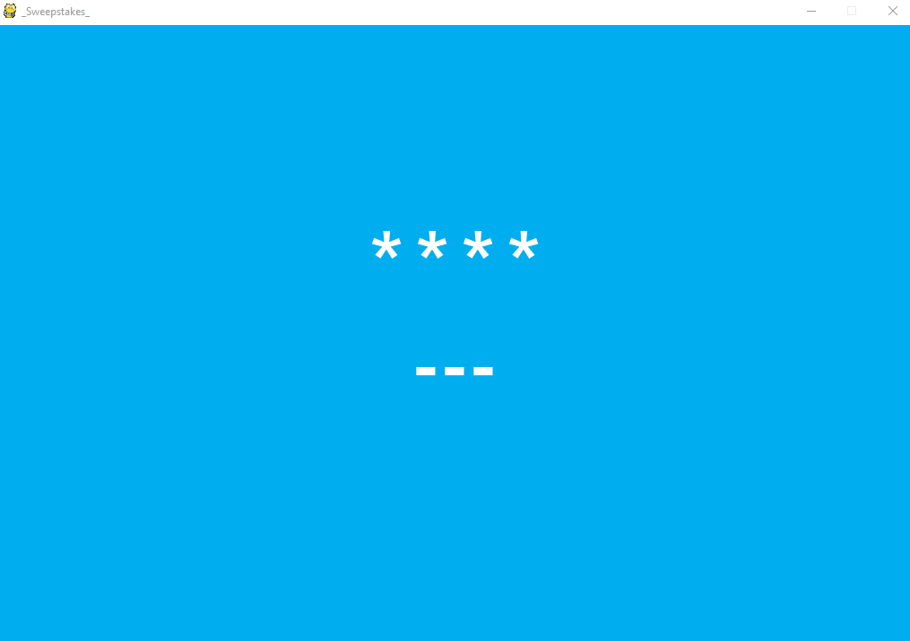

# Sweepstakes

A simple sweepstakes made using [pygame](https://www.pygame.org/) for any promotion

## Installation

Python 3.6+

PyGame 1.9.x


1. Clone the repository:

```bash
$ git clone https://github.com/helizonaldo/sweepstakes
```
or download as zip and extract.

2. In the project directory 

```bash
$ pip install -r requirements.txt
```

## Configuration

By default the text file of contents the participants names is ``participants.txt``, If you want to change settings edit here


```python
participants = [line.strip() for line in open("participants.txt", 'r')]
```
This file consists of two fields _phone_ and "name", separated by a semicolon (the character `;` is the delimiter) a  on each row example:

```
+1-555-555-1234;John Doe
+55-86-9999-1234;Herismar Alves
```


## Usage

```bash
$ python sweepstakes.py
```

Use <kbd>Enter</kbd> key to play and <kbd>Esc</kbd> to close the game.

#### Note:
A few random participants will appear before select the last one and for privacy only the last four phone number appear

ScreenShot
----------




